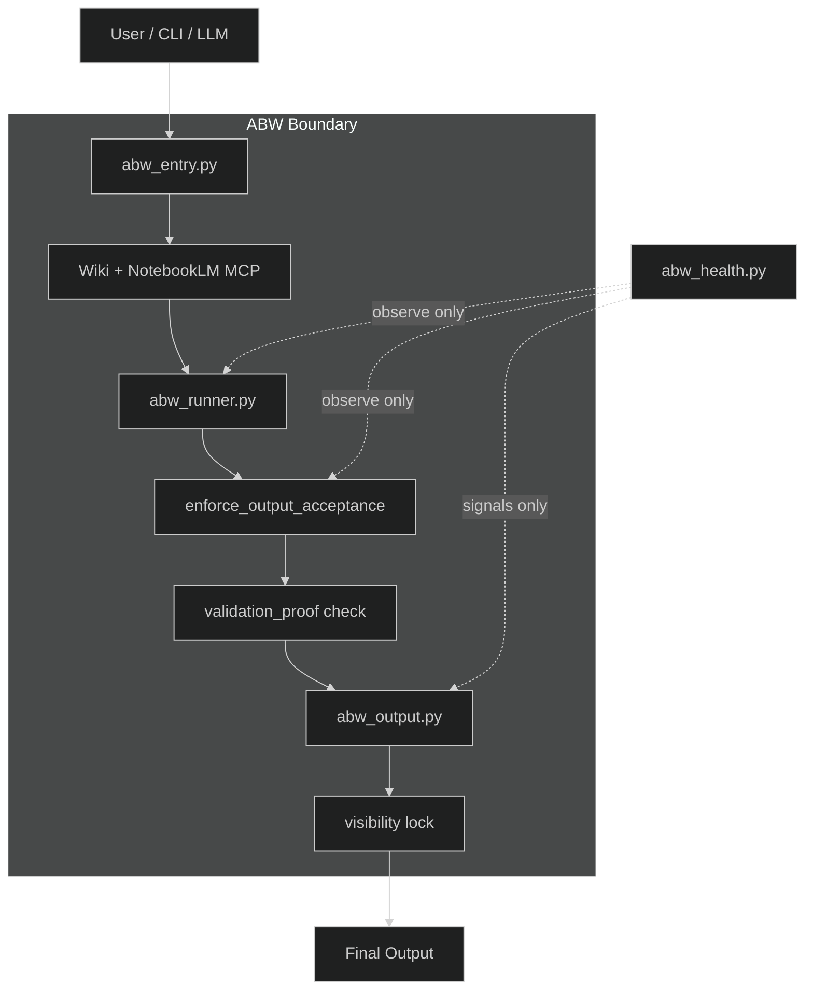
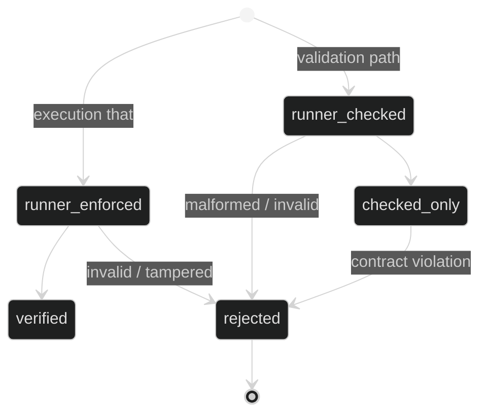
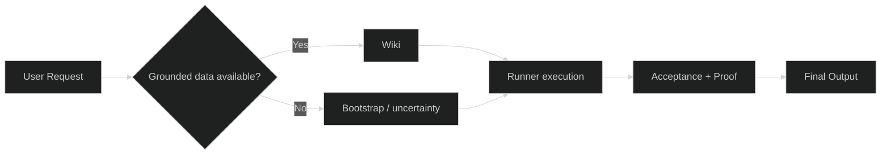

# Hybrid ABW (Anti-Brain-Wiki)

🌐 **Language**  
🇻🇳 **Tiếng Việt** | 🇬🇧 [English](#english)

---

# 🇻🇳 Tiếng Việt

## 1. Tổng quan hệ thống

ABW (Anti-Brain-Wiki) là một **execution boundary + knowledge grounding system** cho hệ AI.

Mục tiêu:

- Ngăn AI tạo output không có kiểm chứng
- Buộc output phải đi qua pipeline kiểm soát
- Phân tách rõ execution, validation, knowledge và observability

> Nếu hệ sai → không thể trông giống đúng

---

## 2. System Boundary (Kiến trúc thực tế)

### Boundary Definition

| Zone | Trust |
|------|-------|
| User / LLM | Untrusted |
| ABW pipeline | Controlled |
| Final Output | Trusted (if verified) |

---

## 3. Execution Model

Luồng thực thi:

`User → Entry → Knowledge → Runner → Acceptance → Output`

Chi tiết:

- `abw_entry.py`: nhận command theo CLI-first
- `abw_runner.py`: thực thi hoặc validate
- `enforce_output_acceptance()`: kiểm tra contract
- `abw_output.py`: chặn output không hợp lệ
- `visibility lock`: chỉ render, không quyết định logic

---

## 4. Trust State Machine

### Semantics

| State | Ý nghĩa |
|------|---------|
| `runner_enforced` | execution thật |
| `runner_checked` | validation |
| `checked_only` | trust thấp |
| `rejected` | bị chặn |

⚠️ Validation không được giả làm execution.

---

## 5. Proof System

`validation_proof = sha256(answer + finalization_block + runtime_id)`

### Enforcement

- Sinh tại runner
- Verify tại acceptance
- Mismatch → reject

### Guarantees

- Không thể sửa output sau runner
- Không thể fake output
- Không thể reuse proof

---

## 6. Knowledge Layer (Wiki + MCP)

### Wiki

Lưu:

- rule
- decision
- context

Là nguồn truth duy nhất.

### NotebookLM MCP

- Truy xuất tri thức từ Wiki
- Cung cấp grounding context

### Knowledge Flow

### Principle

- Không có Wiki → knowledge gap
- Knowledge gap → không suy đoán

---

## 7. Health System (Observer Layer)

Health là observer-only subsystem.

### Signals

Integrity:

- drift
- encoding
- mojibake

Cleanliness:

- clean_pass

Operational:

- validation_rate
- execution_rate
- fallback / policy split

Invariant:

- `validation_rate == fallback + policy`
- Vi phạm → flag
- Không crash hệ

Anomaly:

- DEGRADING
- RECOVERING
- WEAK_DEGRADING
- STABLE

⚠️ Không trigger action.

---

## 8. Failure Scenarios

- Raw output → reject
- Fake proof → reject
- Rewrite sau runner → reject
- Validation giả execution → downgrade
- Runtime drift → detect
- Mojibake → detect
- Missing Wiki → knowledge gap
- Không dùng CLI → ABW không bảo vệ

---

## 9. CLI Interface

- `py scripts/abw_entry.py /abw-ask "task"`
- `py scripts/abw_entry.py /abw-health`
- `py scripts/abw_entry.py /abw-repair`

---

## 10. Design Principles

- Trust = proof, không phải format
- Validation ≠ execution
- Knowledge phải từ Wiki
- Health = observer
- Boundary phải rõ
- Không có signal → không thêm rule

---

## 11. Scope Limitation

ABW KHÔNG đảm bảo:

- logic business đúng
- không bug
- host-level enforcement
- tự sửa lỗi logic

---

## 12. Final Statement

ABW không làm AI đúng hơn.

ABW đảm bảo:

> Nếu sai → không thể trông giống đúng

---

# English

## 1. System Overview

ABW (Anti-Brain-Wiki) is an **execution boundary + knowledge grounding system** for AI systems.

Goals:

- Prevent unverified output
- Force outputs through a controlled pipeline
- Keep execution, validation, knowledge, and observability separate

> If the system is wrong → it must not appear correct

---

## 2. System Boundary (Real Architecture)

### Boundary Definition

| Zone | Trust |
|------|-------|
| User / LLM | Untrusted |
| ABW pipeline | Controlled |
| Final Output | Trusted (if verified) |

---

## 3. Execution Model

Execution flow:

`User → Entry → Knowledge → Runner → Acceptance → Output`

Details:

- `abw_entry.py`: receives commands in CLI-first mode
- `abw_runner.py`: executes or validates
- `enforce_output_acceptance()`: checks contract
- `abw_output.py`: blocks invalid output
- `visibility lock`: renders only, does not decide logic

---

## 4. Trust State Machine

### Semantics

| State | Meaning |
|------|---------|
| `runner_enforced` | real execution |
| `runner_checked` | validation |
| `checked_only` | lower trust |
| `rejected` | blocked |

⚠️ Validation must not pretend to be execution.

---

## 5. Proof System

`validation_proof = sha256(answer + finalization_block + runtime_id)`

### Enforcement

- Generated in the runner
- Verified at acceptance
- Mismatch → reject

### Guarantees

- Output cannot be modified after the runner
- Fake output cannot pass
- Old proof cannot be reused

---

## 6. Knowledge Layer (Wiki + MCP)

### Wiki

Stores:

- rules
- decisions
- context

It is the only truth source.

### NotebookLM MCP

- Retrieves knowledge from the Wiki
- Provides grounding context

### Knowledge Flow

### Principle

- No Wiki → knowledge gap
- Knowledge gap → no guessing

---

## 7. Health System (Observer Layer)

Health is an observer-only subsystem.

### Signals

Integrity:

- drift
- encoding
- mojibake

Cleanliness:

- clean_pass

Operational:

- validation_rate
- execution_rate
- fallback / policy split

Invariant:

- `validation_rate == fallback + policy`
- Violation → flagged
- Does not crash the system

Anomaly:

- DEGRADING
- RECOVERING
- WEAK_DEGRADING
- STABLE

⚠️ It does not trigger actions.

---

## 8. Failure Scenarios

- Raw output → reject
- Fake proof → reject
- Post-runner rewrite → reject
- Validation pretending to be execution → downgrade
- Runtime drift → detect
- Mojibake → detect
- Missing Wiki → knowledge gap
- No CLI usage → ABW cannot protect

---

## 9. CLI Interface

- `py scripts/abw_entry.py /abw-ask "task"`
- `py scripts/abw_entry.py /abw-health`
- `py scripts/abw_entry.py /abw-repair`

---

## 10. Design Principles

- Trust = proof, not format
- Validation ≠ execution
- Knowledge must come from the Wiki
- Health = observer
- Boundaries must be explicit
- No signal → no new rule

---

## 11. Scope Limitation

ABW does NOT guarantee:

- correct business logic
- no bugs
- host-level enforcement
- automatic logic repair

---

## 12. Final Statement

ABW does not make AI more correct.

ABW ensures:

> If the system is wrong → it cannot appear correct
