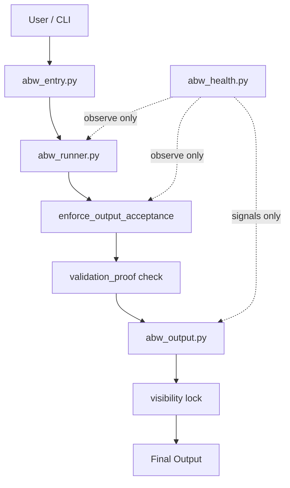
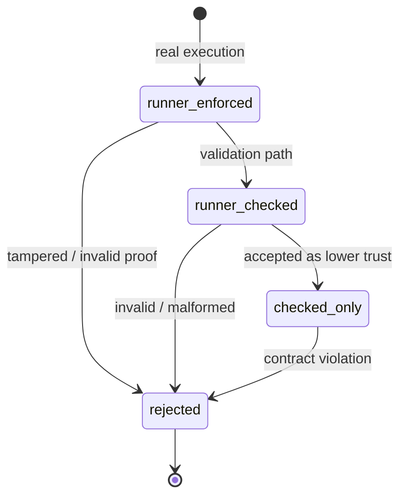
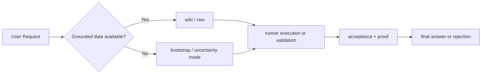

# Hybrid ABW (Anti-Brain-Wiki)

🌐 **Language**  
> 🇻🇳 **Tiếng Việt** | 🇬🇧 [English](#english)

---

# 🇻🇳 Tiếng Việt

## ABW là gì

ABW là execution boundary cho hệ AI theo hướng CLI-first.

- Output chỉ được chấp nhận nếu đi qua runner
- Output phải có `validation_proof`
- Validation không được giả làm execution
- Health chỉ quan sát, không điều khiển

> Nếu hệ sai, ABW phải làm cho nó không thể trông giống đúng

---

## Sơ đồ boundary hệ thống

---

## Trust state machine

---

## Knowledge flow

---

## Proof system

`validation_proof = sha256(answer + finalization_block + runtime_id)`

- Sinh tại runner
- Verify tại acceptance gate
- Proof sai hoặc stale proof phải bị reject

---

## Trust model

| State | Ý nghĩa |
|------|--------|
| `runner_enforced` | execution thật |
| `runner_checked` | kết quả validation, trust thấp hơn |
| `checked_only` | output được hạ mức tin cậy |
| `rejected` | bị chặn |

---

## Health layer

### Integrity
- drift
- encoding
- mojibake

### Cleanliness
- clean_pass

### Operational
- validation_rate
- execution_rate
- fallback / policy split

### Invariant
- `validation_rate == fallback + policy`

> Các signal này dùng để quan sát. Chúng không được lái control logic.

---

## CLI

- `py scripts/abw_entry.py /abw-ask "task"`
- `py scripts/abw_entry.py /abw-health`
- `py scripts/abw_entry.py /abw-repair`

---

## Failure scenarios

Xem chi tiết

- Raw output -> reject
- Fake proof -> reject
- Post-runner rewrite -> reject
- Validation giả execution -> downgrade
- Runtime drift -> detect
- Mojibake -> detect

---

# English

## What ABW Is

ABW is a CLI-first execution boundary for AI systems.

- Output must pass through the runner
- Output must carry `validation_proof`
- Validation must not pretend to be execution
- Health remains observer-only

> If the system is wrong, ABW should prevent it from appearing correct

---

## System boundary diagram

---

## Trust state machine

---

## Knowledge flow

---

## Proof system

`validation_proof = sha256(answer + finalization_block + runtime_id)`

- Generated in the runner
- Verified at the acceptance gate
- Invalid or stale proof must be rejected

---

## Trust model

| State | Meaning |
|------|---------|
| `runner_enforced` | real execution |
| `runner_checked` | validation result, lower trust |
| `checked_only` | downgraded accepted output |
| `rejected` | blocked |

---

## Health layer

### Integrity
- drift
- encoding
- mojibake

### Cleanliness
- clean_pass

### Operational
- validation_rate
- execution_rate
- fallback / policy split

### Invariant
- `validation_rate == fallback + policy`

> These signals are for observation only. They must not leak into control logic.

---

## CLI

- `py scripts/abw_entry.py /abw-ask "task"`
- `py scripts/abw_entry.py /abw-health`
- `py scripts/abw_entry.py /abw-repair`

---

## Failure scenarios

View details

- Raw output -> reject
- Fake proof -> reject
- Post-runner rewrite -> reject
- Validation pretending to be execution -> downgrade
- Runtime drift -> detect
- Mojibake -> detect

