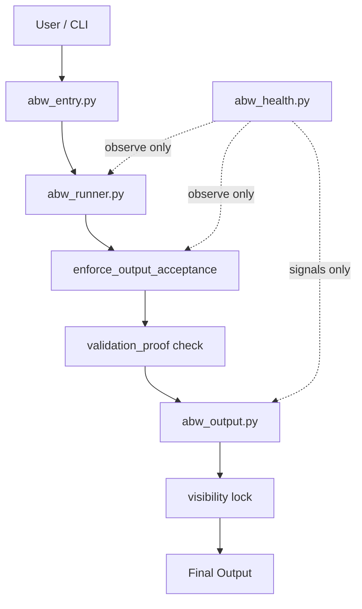
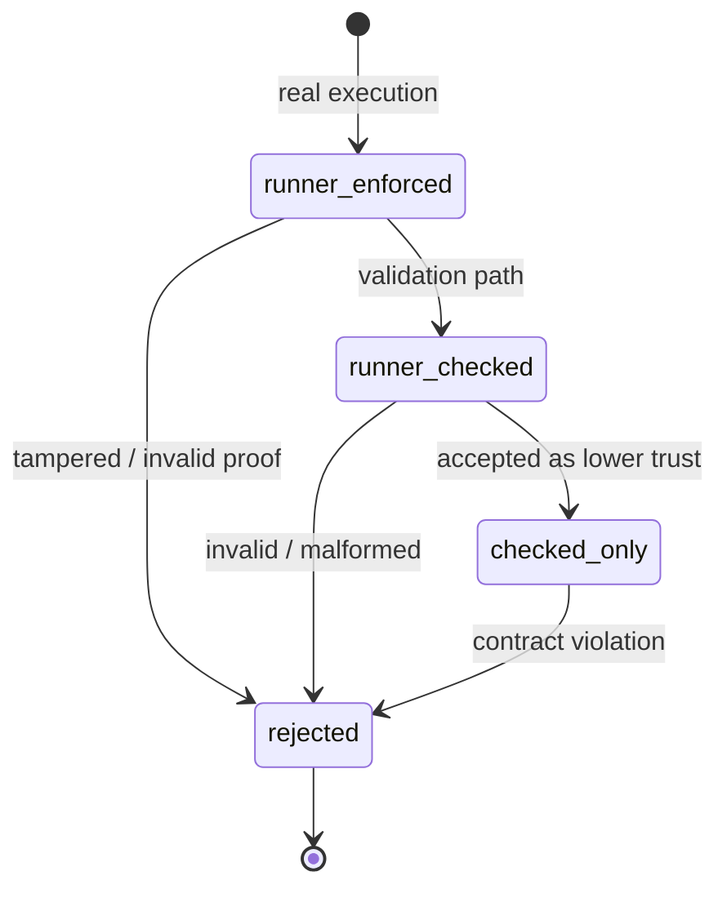
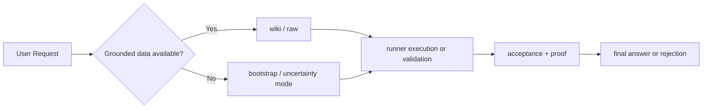

# Hybrid ABW (Anti-Brain-Wiki)

> ⚠️ This README reflects the current production-level architecture.

🌐 **Language**  
> 🇻🇳 **Tiếng Việt** | 🇬🇧 [English](#english)

---

# 🇻🇳 Tiếng Việt

## ABW là gì

ABW là execution boundary cho hệ AI theo hướng CLI-first.

- Output chỉ được chấp nhận nếu đi qua runner
- Output phải có `validation_proof`
- Validation không được giả làm execution
- Health chỉ quan sát, không điều khiển

> Nếu hệ sai, ABW phải làm cho nó không thể trông giống đúng

---

## Sơ đồ boundary hệ thống



---

## Trust state machine



---

## Knowledge flow



---

## Proof system

`validation_proof = sha256(answer + finalization_block + runtime_id)`

- Sinh tại runner
- Verify tại acceptance gate
- Proof sai hoặc stale proof phải bị reject

---

## Trust model

| State | Ý nghĩa |
|------|--------|
| `runner_enforced` | execution thật |
| `runner_checked` | kết quả validation, trust thấp hơn |
| `checked_only` | output được hạ mức tin cậy |
| `rejected` | bị chặn |

---

## Health layer

### Integrity
- drift
- encoding
- mojibake

### Cleanliness
- clean_pass

### Operational
- validation_rate
- execution_rate
- fallback / policy split

### Invariant
- `validation_rate == fallback + policy`

> Các signal này dùng để quan sát. Chúng không được lái control logic.

---

## CLI

- `py scripts/abw_entry.py /abw-ask "task"`
- `py scripts/abw_entry.py /abw-health`
- `py scripts/abw_entry.py /abw-repair`

---

## Failure scenarios

<details>
<summary>Xem chi tiết</summary>

- Raw output -> reject
- Fake proof -> reject
- Post-runner rewrite -> reject
- Validation giả execution -> downgrade
- Runtime drift -> detect
- Mojibake -> detect

</details>

---

## 🚀 System Update

### Tiếng Việt

Phần này bổ sung trạng thái hệ thống hiện tại mà không thay đổi các phần mô tả cũ ở trên.

- Proof system hiện dùng `HMAC(secret_key, answer + finalization_block + runtime_id + nonce + binding_source)` thay cho `SHA256` công khai.
- Payload proof hiện bắt buộc có `nonce` và `binding_source`, và proof chỉ hợp lệ khi được runner ký bằng secret nội bộ.
- Knowledge grounding không còn dựa trên heuristic string matching như `"wiki"`, `"source"`, `"unknown"`.
- Knowledge chỉ được lấy từ nguồn thật:
  - local wiki
  - explicit local file/source
- Nếu không tìm thấy nguồn thật, hệ thống ghi knowledge gap vào `.brain/knowledge_gaps.json` và hạ về `E0_unknown`.
- `abw_accept` đã được tích hợp vào canonical execution path của `/abw-ask`.
- `runner_enforced` chỉ được giữ khi execution thật xảy ra và `evaluation.accepted == True`.
- Nếu `abw_accept` không pass hoặc không accepted, output bị hạ xuống `runner_checked`.
- Hệ thống đã có self-update:
  - `/abw-update`
  - `/abw-update <commit_hash>`
  - `/abw-rollback`
- Self-update dùng `git worktree` để staging, có backup, integrity check, atomic switch thực dụng, và rollback khi lỗi.
- Runtime integrity hiện kiểm tra critical files, hash baseline của runtime, và có trạng thái `integrity_compromised` nếu phát hiện sai lệch.
- Với các hardening hiện tại, mức trưởng thành hệ thống đã tiến từ `SOFT_BOUND` lên `PRACTICAL_HARD_BOUND`.

### English

This section adds the current system state without modifying the earlier descriptive sections above.

- The proof system now uses `HMAC(secret_key, answer + finalization_block + runtime_id + nonce + binding_source)` instead of a public `SHA256` hash.
- Proof payloads now require both `nonce` and `binding_source`, and proofs are only valid when signed by the runner with its internal secret.
- Knowledge grounding no longer relies on heuristic string matching such as `"wiki"`, `"source"`, or `"unknown"`.
- Knowledge is only retrieved from real sources:
  - local wiki
  - explicit local file/source
- If no real source is found, the system logs a knowledge gap to `.brain/knowledge_gaps.json` and downgrades to `E0_unknown`.
- `abw_accept` is now integrated into the canonical `/abw-ask` execution path.
- `runner_enforced` is only retained when real execution happened and `evaluation.accepted == True`.
- If `abw_accept` does not pass or is not accepted, the output is downgraded to `runner_checked`.
- The system now includes self-update commands:
  - `/abw-update`
  - `/abw-update <commit_hash>`
  - `/abw-rollback`
- Self-update uses `git worktree` staging, backup, integrity checks, a practical atomic switch, and rollback on failure.
- Runtime integrity now verifies critical files, compares runtime hash baselines, and exposes an `integrity_compromised` state on mismatch.
- With the current hardening, system maturity has moved from `SOFT_BOUND` to `PRACTICAL_HARD_BOUND`.

---

## 🔧 Advanced Architecture

### Trust Boundary Diagram

```mermaid
flowchart TD

A[User / CLI Input] --> B[Runner]

subgraph Untrusted Zone
    B --> C[Candidate Answer]
end

subgraph Controlled Execution
    C --> D[Execution / Artifact]
    D --> E[abw_accept Validation]
    E --> F[Acceptance Gate]
end

subgraph Trusted Zone
    F -->|HMAC Verified| G[Final Output]
    G --> H[Render (Visibility Lock)]
end

C -.->|NO TRUST| F
D -->|Evidence| F
```

### Self-Update Pipeline

```mermaid
flowchart TD

A[/abw-update/] --> B[Fetch origin]
B --> C[Resolve target commit]

C --> D[Create staging (git worktree)]
D --> E[Integrity Check]

E -->|fail| X[Abort]

E -->|pass| F[Backup current]
F --> G[Atomic Switch]

G --> H[Update version file]
H --> I[Reload modules]

I --> J[System Stable]
```

### Proof Flow

```mermaid
flowchart TD

A[Runner Output] --> B[Generate Proof (HMAC)]

B --> C[Output Payload]

C --> D[Acceptance Gate]

D --> E{Verify Proof}

E -->|Invalid| X[Reject]

E -->|Valid| F[Check Finalization]

F -->|Fail| X

F -->|Pass| G[Accepted Output]
```

---

## 🧪 End-to-End Demo (Thực thi từ đầu đến cuối)

### 🇻🇳 Tiếng Việt

Mục tiêu: Chứng minh hệ thống thực thi thật với:
- execution (chạy lệnh / xử lý)
- artifact (file/log)
- validation (abw_accept)
- proof (HMAC)
- acceptance gate

#### Input (Yêu cầu)

`/abw-ask "Dịch thuật ngữ: 'drum unit' trong tài liệu máy in và trích nguồn"`

#### Execution (Thực thi)

- Truy vấn wiki nội bộ: `wiki/glossary_printer.md`
- Tìm thấy:
  - `drum unit -> cụm trống`
- Không có source ngoài -> không dùng LLM để đoán

#### Artifact (Bằng chứng)

`.artifacts/run_20250101_101530.txt`

```text
runtime_id: 1704100530
source: wiki/glossary_printer.md
term: drum unit
result: cụm trống
```

#### Validation (Kiểm chứng)

`abw_accept` kiểm tra:
- file tồn tại
- `runtime_id` khớp
- nội dung hợp lệ

`evaluation.accepted = True`

#### Proof (Bằng chứng mật mã)

`proof = HMAC(secret, answer + finalization_block + runtime_id + nonce + binding_source)`

```text
validation_proof: a8f3c2e1...
nonce: 9b12f0...
binding_source: cli
```

#### Acceptance (Chấp nhận)

- verify proof -> PASS
- check finalization -> PASS

`binding_status: runner_enforced`

#### Output (Kết quả cuối)

`"drum unit" = "cụm trống"`

`Nguồn: wiki/glossary_printer.md`

#### Trường hợp thiếu tri thức

`/abw-ask "Giải thích công nghệ XYZ-123"`

Kết quả:
- Không tìm thấy tri thức đáng tin cậy.
- Đã ghi nhận vào `knowledge_gaps`.

---

### 🇬🇧 English

Goal: Demonstrate real execution with:
- execution
- artifact generation
- validation via `abw_accept`
- cryptographic proof
- acceptance enforcement

#### Input

`/abw-ask "Translate 'drum unit' and provide source"`

#### Execution

- Query local wiki: `wiki/glossary_printer.md`
- Found:
  - `drum unit -> cụm trống`
- No guessing or hallucination

#### Artifact

`.artifacts/run_20250101_101530.txt`

```text
runtime_id: 1704100530
source: wiki/glossary_printer.md
term: drum unit
result: cụm trống
```

#### Validation

`abw_accept` checks:
- file exists
- `runtime_id` matches
- content valid

`evaluation.accepted = True`

#### Proof

`proof = HMAC(secret, answer + finalization_block + runtime_id + nonce + binding_source)`

#### Acceptance

- proof verified
- finalization valid

`binding_status: runner_enforced`

#### Output

`"drum unit" = "cụm trống"`

`Source: wiki/glossary_printer.md`

#### Missing knowledge case

`/abw-ask "Explain XYZ-123 technology"`

Result:
- No trusted knowledge found.
- Logged as knowledge gap.

---

# English

## What ABW Is

ABW is a CLI-first execution boundary for AI systems.

- Output must pass through the runner
- Output must carry `validation_proof`
- Validation must not pretend to be execution
- Health remains observer-only

> If the system is wrong, ABW should prevent it from appearing correct

---

## System boundary diagram


---

## Trust state machine


---

## Knowledge flow


---

## Proof system

`validation_proof = sha256(answer + finalization_block + runtime_id)`

- Generated in the runner
- Verified at the acceptance gate
- Invalid or stale proof must be rejected

---

## Trust model

| State | Meaning |
|------|---------|
| `runner_enforced` | real execution |
| `runner_checked` | validation result, lower trust |
| `checked_only` | downgraded accepted output |
| `rejected` | blocked |

---

## Health layer

### Integrity
- drift
- encoding
- mojibake

### Cleanliness
- clean_pass

### Operational
- validation_rate
- execution_rate
- fallback / policy split

### Invariant
- `validation_rate == fallback + policy`

> These signals are for observation only. They must not leak into control logic.

---

## CLI

- `py scripts/abw_entry.py /abw-ask "task"`
- `py scripts/abw_entry.py /abw-health`
- `py scripts/abw_entry.py /abw-repair`

---

## Failure scenarios

<details>
<summary>View details</summary>

- Raw output -> reject
- Fake proof -> reject
- Post-runner rewrite -> reject
- Validation pretending to be execution -> downgrade
- Runtime drift -> detect
- Mojibake -> detect

</details>
